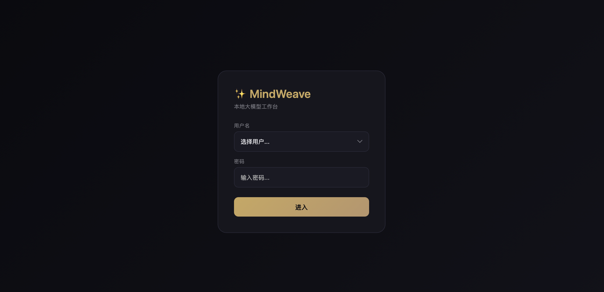

# MindWeave — 本地 AI 工作台

> 内网断网可用 · 多账号隔离 · Markdown 对话导出 · 纯本地部署


**MindWeave**是一个基于 [Ollama](https://ollama.com) 和 Laravel 构建的本地 AI 聊天工具，专为内网环境设计。无需互联网，无需 API Key，所有数据完全私有。



---

## ✨ 功能特性

- 🌐 **完全离线** — 依赖 Ollama 本地模型，断网也能用
- 🔐 **多账号系统** — 每个用户独立数据目录，完全隔离
- 🔑 **密码保护** — 可为账号设置访问密码，防止未授权访问
- 🤖 **多模型切换** — 一键切换不同 Ollama 模型
- 📝 **Markdown 渲染** — 对话内容支持代码高亮、列表、表格等格式
- 💾 **会话导出** — 支持导出为 Markdown 或 JSON 格式
- 💬 **上下文记忆** — 支持多轮连续对话，保留上下文
- 📁 **可配置存储** — 数据存放目录可自定义
- 🎨 **深色主题** — 护眼深色界面，适合长时间使用
- 🎯 **轻量部署** — 一个 `composer install` 即可运行

---

## 📋 系统要求

- **PHP** 8.2+
- **Composer** 2.x
- **Ollama** 已在本地运行（`ollama serve`）
- **Mac / Linux / Windows**（WSL2 推荐）

---

## 🚀 快速安装

### 1. 克隆项目

```bash
git clone https://github.com/weinotes/mindweave.git
cd mindweave
```

### 2. 安装依赖

```bash
composer install
```

### 3. 配置环境

```bash
cp .env.example .env
php artisan key:generate
php artisan migrate
```

### 4. 拉取 Ollama 模型

```bash
# 首次使用需要下载模型（以 qwen2.5 为例）
ollama pull qwen2.5:latest
ollama pull llama3.2:latest
ollama pull codellama:latest

# 查看已安装模型
ollama list
```

### 5. 启动服务

```bash
php artisan serve --host=0.0.0.0 --port=3456
```

访问 **http://localhost:3456** 即可使用。

---

## ⚙️ 配置说明

### 修改端口

```bash
php artisan serve --port=8080
```

### 修改 Ollama 地址（远程服务器）

在 `.env` 中添加：

```env
OLLAMA_HOST=http://192.168.1.100:11434
```

### 多用户数据目录

在「设置 → 存储」中可自定义数据存放路径，支持以下预设：

- `~/mindweave/userdata`（默认）
- `~/Documents/mindweave-data`
- `~/Desktop/mindweave-data`
- 自定义路径

### 设置访问密码

首次登录为访客模式（无密码）。可在「设置 → 账号」中为当前账号设置密码。

---

## 🗂️ 项目结构

```
mindweave/
├── app/
│   ├── Http/Controllers/
│   │   ├── ChatController.php      # 聊天核心逻辑
│   │   └── LoginController.php      # 登录认证
│   ├── Middleware/
│   │   └── CheckPassword.php        # 密码认证中间件
│   └── Services/
│       └── UserService.php           # 用户/会话管理
├── config/
│   └── ollama.php                    # Ollama API 配置
├── docs/
│   └── index.html                    # 用户使用文档
├── public/
│   └── js/marked.min.js              # Markdown 渲染库（本地）
├── resources/views/
│   ├── chat.blade.php                # 主聊天界面
│   └── login.blade.php               # 登录页面
├── routes/
│   └── web.php                       # 路由定义
├── userdata/                         # 用户数据（已 gitignore）
│   ├── auth.json                     # 密码存储
│   ├── sessions/                     # 会话记录
│   └── users/                        # 用户目录
├── .env                              # 环境配置（已 gitignore）
├── composer.json
└── LICENSE
```

---

## 🔧 常见问题

### 启动后显示空白页？

```bash
php artisan route:list
```

确保 Ollama 服务已启动：

```bash
ollama serve
```

### 发送消息提示"连接 Ollama 失败"？

确认 `.env` 中的 `OLLAMA_HOST` 配置正确，默认 `http://localhost:11434`。

### 如何更换模型？

在聊天界面左上角的下拉框中选择已安装的模型。

### 如何查看 Ollama 模型列表？

```bash
ollama list
```

---

## 📖 文档

详细使用说明请参阅 [docs/index.html](./docs/index.html)。

---

## 📜 License

MIT License — 详见 [LICENSE](./LICENSE) 文件。
